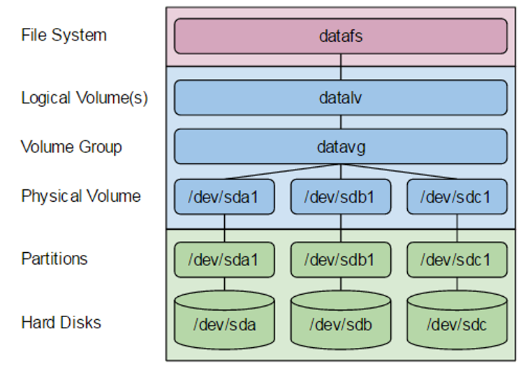
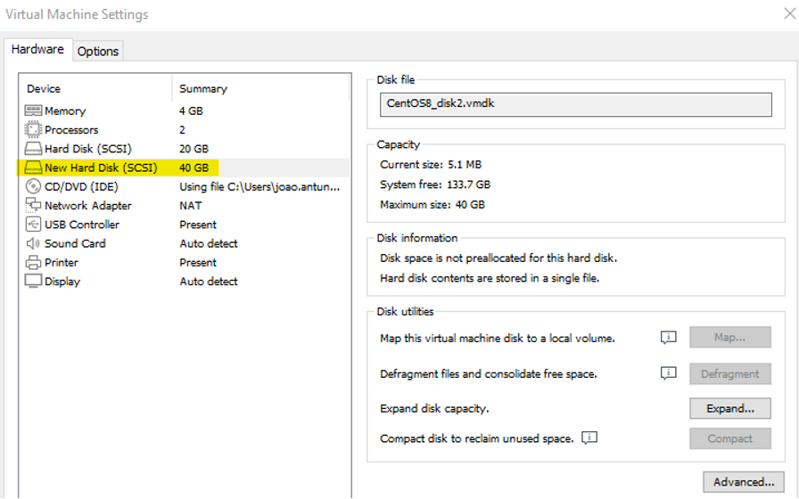
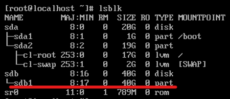
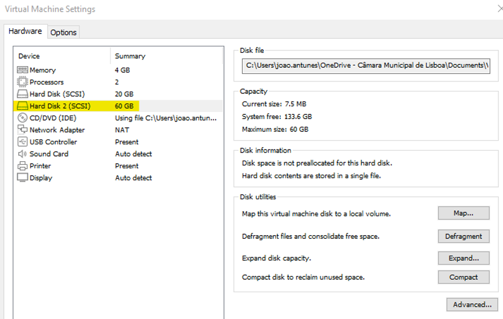
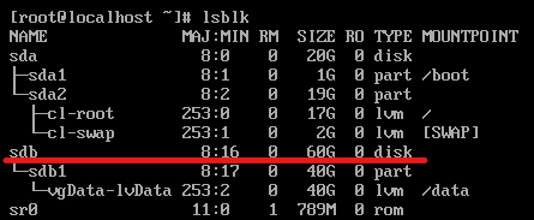
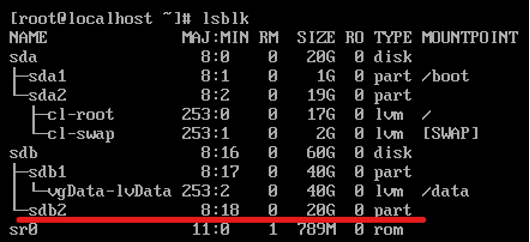

# LVM disks

### Create:

LVM structure:



<br>
Create disk on vmware:




List the block device to see the newly assigned vSphere hard disk

```sh
lsblk
```



Format the disk partition. Get the device name from the previous lsblk output

```sh
fdisk /dev/sdb
```

Create a new partition:

- n (new partition)
- p (primary)
- (Press ENTER) (Use default partition number)
- (Press ENTER) (Use default first sector)
- (Press ENTER) (Use default last sector)
- t (change the partition type)
- 8e (Linux LVM)
- w (write)


Initialize the physical volume

```sh
pvcreate /dev/sdb1
```

Create the volume group

```sh
vgcreate vgData /dev/sdb1
```

Create the logical volume for the volume group

```sh
lvcreate -n lvData -l +100%FREE vgData
```

Construct an XFS filesystem on the new logical volume

```sh
mkfs.xfs /dev/vgData/lvData
```

Mount a Unix directory to the logical volume
Edit the text file /etc/fstab and add the line below:

```
/dev/vgData/lvData     /data               xfs     defaults        0 0
```

Create directory /data
```sh
mkdir -p /data
```

Mount directory /data
```sh
mount /data
```

Display the new directory
```sh
df -h
```

&nbsp;
### Resize

Expand disk in 20Gb




List the block device to see the resized vSphere hard disk

```sh
lsblk
```



Format the disk partition. Get the device name from the previous lsblk output

```sh
fdisk /dev/sdb
```

Create a new partition:

- n (new partition)
- p (primary)
- (Press ENTER) (Use default partition number)
- (Press ENTER) (Use default first sector)
- (Press ENTER) (Use default last sector)
- t (change the partition type)
- (choose partition 2)
- 8e (Linux LVM)
- w (write)


List the block device again to display the new disk partition /dev/sdb2

```sh
lsblk
```




Initialize the physical volume

```sh
pvcreate /dev/sdb2
```


Extend the volume group

```sh
vgextend vgData /dev/sdb2
```


Extend the logical volume for the volume group and extends the filesystem

```sh
lvextend -l +100%FREE -r /dev/vgData/lvData
```

Display the new space

```sh
df -h
```

